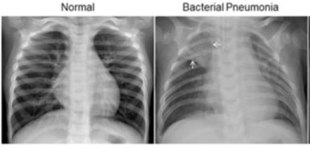

# Pneumonia Classification

This is a based convolutional neural network for detecting pneumonia in frontal-view chext X-ray images.

## Dataset

The project uses data from the [Chest X-Ray Images](https://www.kaggle.com/paultimothymooney/chest-xray-pneumonia) dataset on kaggle.

The dataset is organized into 3 folders (train, test, val) and contains subfolders for each image category (Pneumonia/Normal). There are 5,863 X-Ray images (JPEG) and 2 categories (Pneumonia/Normal). Chest X-ray images (anterior-posterior) were selected from retrospective cohorts of pediatric patients of one to five years old from Guangzhou Women and Children’s Medical Center, Guangzhou. All chest X-ray imaging was performed as part of patients’ routine clinical care. For the analysis of chest x-ray images, all chest radiographs were initially screened for quality control by removing all low quality or unreadable scans. The diagnoses for the images were then graded by two expert physicians before being cleared for training the AI system. In order to account for any grading errors, the evaluation set was also checked by a third expert.

## Prerequisites

- Google Colaboratory

## Usage

1. Clone this repository.

2. Download chest X-ray images from [kaggle](https://www.kaggle.com/paultimothymooney/chest-xray-pneumonia).

3. Run `ModelCNN.ipynb`

## Results

- Model with dropout in the fully connected layers achieves a test accuracy of 91%.
  - run `ModelCNN.ipynb`

## Github Pages

- If you want to see more about this experiment you can go to my [githubpages](https://rickygunawan09.github.io/Pneumonia_Classification/) or if you want to try with your lungs/chest x-ray come to my [heroku](https://shielded-stream-99265.herokuapp.com/) link. Thank you
